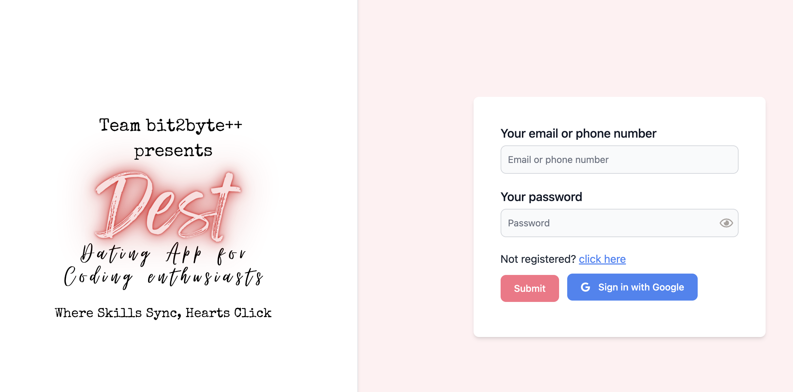

# **bit2byte++ presents:  *Dest***

**Abhishek:***(excitedly pointing at the screen)* Guys, check this our project is live & it's crazy.

**Arpit:** *(nodding in agreement)* We have matched users using cosine similarity. This will reduce computation cost & also give us the best results!

**Hariom:** *(nodding in agreement)* That's right! We're bringing together the worlds of tech and romance like never before.

On the laptop screen, a sleek interface showcases the features of their app: "Skills Sync, Hearts Click."

[INSERT SCREENSHOT]

**Tech Stack:** MERN

**Features:**

* Register and Login

  
* Update Profile

  
* Set Preferences
* Swipe and Match
* User Chat
* Profile Filtering

**Advanced Features:**

* OAuth with Google and Facebook
* Compatibility Algorithm
* Video Chat
* Movie Date
* Payment Gateway

Shout out to all the developers that were a part of this amazing project

* [Abhishek Singh](https://github.com/itsAbh15hek)
* [jigyasu Singh](https://github.com/JaTin-at-git)
* [Arpit Rathore](https://github.com/ArpitRathore2020)
* [Hariom Joshi](https://github.com/HariomJoshi)
